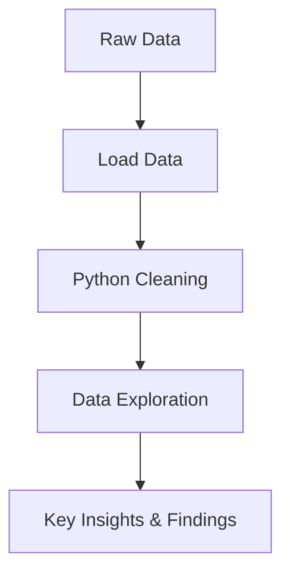

# 💡 Exploring NYC's 2024 Airbnb Market Through Data – A Python EDA Project


This project focuses on performing an in-depth **Exploratory Data Analysis (EDA)** on Airbnb listings data for New York City. 
- The goal is to extract insights from the data related to pricing, availability, and listing types, using **Python** and powerful data analysis libraries.
- This analysis includes **univariate** and **bivariate** insights, **feature engineering**, and **data visualization** to better understand market behavior and trends.

--- 

## 📌 Project Overview

This project analyzes Airbnb listings in New York for 2024 to:

- Understand rental trends across boroughs and room types  
- Identify outliers in pricing and availability  
- Visualize spatial and statistical relationships between variables  
- Aid stakeholders (hosts, travelers, and investors) in making data-driven decisions  

### How can Airbnb hosts, guests, and the company better understand the dynamics of short-term rentals in New York City?

**More specifically:**

- Which boroughs have the highest/lowest average prices?  
- What types of listings are more common and affordable?  
- Are there any patterns in geographical distribution?  
- What influences listing price and availability?

---

### Expected Outcomes 🎯 
The expected outcome of this Project is to:
- Understand Pricing Trends
- Identify Key Factors Affecting Price
- Explore Availability and Review Patterns
- Geographic Distribution
- Provide Actionable Recommendations
- Enhance Decision-Making

---

## 🧰 Tools Stack
- **Python**  
  - `pandas`, `numpy` – Data Cleaning, Data manipulation  
  - `matplotlib`, `seaborn` – Data visualization
  -      
- **Jupyter Notebook** – For interactive development
- 
- **Git & GitHub** – Version control and project showcase

---

## Data Source

The dataset is sourced from [Inside Airbnb](http://insideairbnb.com/), which provides detailed information on Airbnb listings in various cities around the world.

---

## Data Processing Pipeline


---

### Steps Taken In The Project
- Importing all Libraries & dependenices
- Load datasets
- initial exploration
- Data cleaning
- Data Analysis & Visualizations

---

## Step 1
**Import all needed Libraries**
```python
import pandas as pd
import numpy as np
import matplotlib.pyplot as plt
import seaborn as sns

%matplotlib inline
```
## Step 2
**Load Datasets**
```python
data = pd.read_csv('dataset.csv')
```
## Step 3

### Data Exploration
```python
#first 10 rows of dataset
data.head(10)

#last 10 rows of dataset
data.tail(5)

#shape of dataset
data.shape

#information about columns, datatypes, general DataFrame
data.info()

#Statistical Summary Of all Numerical Columns
data.describe()

# Statistical Summary Of all Columns
data.describe(include='any')
```

### 🧼 Data Cleaning Steps

```python
# dropping all missing values rows
data.dropna(inplace=True)

# checking for Null Values
data.isnull().sum()

# data.fillna()
data.isnull().sum()

# checking for duplicates rows
data.duplicated().sum()

# deleting all duplicated rows
data.drop_duplicates(inplace=True)

# confirming dropped duplicated rows
data.duplicated().sum()

# type casting 
data.dtypes

# changing data types
data['id'] = data['id'].astype(object)
data.dtypes

data['host_id'] = data['host_id'].astype(object)
data.dtypes
```
## 🧮  Exploratory Data Analysis (EDA)
#### Feature Engineering
```python
# Adding a Price per bed column
df['price per bed']= df['price']/df['beds']
df.head()

# average price by neighbourhoud
df.groupby(by='neighbourhood_group')['price'].mean()

# average price per bed
df.groupby(by='neighbourhood_group')['price per bed'].mean()
```

### Univariate Analysis
```python
# idenfying outliers in price

df = data[data['price'] < 1500]

sns.boxplot(data=df, x='price');
```


```python
#Price distribuion

plt.figure(figsize=(8, 5))
sns.histplot(data=df, x='price', bins=100)
plt.title('Price Distribuition')
plt.ylabel("Frequency")
plt.show()
```


```python
#Yearly Availability Distribuition

plt.figure(figsize=(6, 3))
sns.histplot(data=df, x='availability_365')
plt.title('Yearly Availability Distribuition')
plt.ylabel("Frequency")
plt.show()
```


### Bi Variable Analysis (One variable depenency in another variable)

```python
# price dependency on neighbourhood

sns.barplot(data=df, x='neighbourhood_group', y='price', hue='room_type')
plt.legend(loc='upper right')
```


```python
# number of reviews and price relationship

plt.figure(figsize=(8, 5))
plt.title("Locality and Review Dependency")
sns.scatterplot(data=df, x='number_of_reviews', y='price', hue='neighbourhood_group')
plt.show()
```


```python
#Geographical Distribution of AirBnb Listing

plt.figure(figsize=(10, 7))
sns.scatterplot(data=df, x='longitude', y='latitude', hue='room_type')
plt.title("Geographical Distribution of AirBnb Listing")
plt.show()
```


```python
#pairwise relationships between multiple numerical features in your dataset

#Detect relationships between multiple variables

sns.pairplot(data=df, vars=['price', 'minimum_nights', 'number_of_reviews', 'availability_365'], hue='room_type');
```


```python
# heat map - correlation of one variable with others for numerical column

corr = df[['latitude', 'longitude', 'price', 'minimum_nights', 'number_of_reviews', 'reviews_per_month', 'availability_365', 'beds']].corr()
corr
plt.figure(figsize=(8, 6))
sns.heatmap(data=corr, annot=True);
```


--- 

### Desktop Screenshots


---

## 📝 Key Findings, Conclusions & Recommendations
  1. Manhattan is the most expensive and saturated borough for Airbnb listings.
  2. Private rooms in Brooklyn provide more affordable alternatives.
  3. Some listings remain inactive (availability = 0), which may need cleanup.
  4. price_per_bed can help evaluate cost efficiency for group travelers.
  5. Listings with unusually high prices should be flagged for quality checks.

## Recommendations:
  1. Hosts should optimize pricing based on room type and location trends.
  2. Guests can consider Brooklyn for more affordable and highly-reviewed options.
  3. Airbnb could enhance listing visibility for active, affordable locations.

##  Summary Of Key Visualizations
- Boxplot for detecting outliers in price
- Histograms for price and availability distribution
- Geographical scatterplot to visualize listing locations by room type
- Barplots showing average price per borough and room type
- Heatmap for correlation among numerical features
- Pairplot for identifying relationships between multiple features

---

## 📌 About Me
Hi, I'm Oluwatosin Amosu Bolaji, a Data Analyst with strong skills in Python, SQL, Power BI, and Excel. I turn raw data into actionable insights through automation, data storytelling, and visual analytics. My work is rooted in analytical thinking, strong business acumen, and technical expertise. Whether it's uncovering hidden trends, optimizing workflows, or translating data into compelling stories, I bring clarity and direction to data—helping organizations make smarter, faster decisions.

## 💡 Tools & Tech:
- **Python** (Pandas, NumPy, Matplotlib, Seaborn)
- **SQL** (MsSQL, Postgree, MySQL)
- **Microsoft Power BI**
- **Microsoft Excel**
- 🔹 **Key Skills:** Data wrangling, dashboarding, reporting, and process optimization.
-    


#### 🚀 **Always learning. Always building. Data-driven to the core.**  

### 📫 **Let’s connect!**  
- 📩 oluwabolaji60@gmail.com
- 🔗 : [LinkedIn](https://www.linkedin.com/in/oluwatosin-amosu-722b88141)
- 🌐 : [My Portfolio](https://www.datascienceportfol.io/oluwabolaji60) 
- 𝕏 : [Twitter/X](https://x.com/thee_oluwatosin?s=21&t=EqoeQVdQd038wlSUzAtQzw)
- 🔗 : [Medium](https://medium.com/@oluwabolaji60)
- 🔗 : [View my Repositories](https://github.com/Tbrown1998?tab=repositories)


